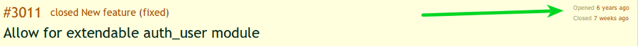

!SLIDE
# Two great features added in Django 1.5

* "Experimental" Python 3 Support
* Custom User models

See [the Django 1.5 release
notes](https://docs.djangoproject.com/en/dev/releases/1.5/) for more
features and changes.

!SLIDE incremental
# Ticket #3011



* First requested six years ago
* Most requested/debated feature ever?
* [5 proposed solutions](https://code.djangoproject.com/wiki/ContribAuthImprovements) (solution 2 has 5 variations)
* Implemented by Russell Keith-Magee 7 weeks ago (option 2a)

!SLIDE incremental
# You've got options

* Happy with the status quo? Use ``auth.User`` as is.
* Use (the now deprecated) ``AUTH_PROFILE_MODULE``? Subclass
  ``AbstractUser``
* Want to change any fields? Subclass ``AbstractBaseUser``

!SLIDE incremental
# Working with ``ABSTRACT_BASE_USER``

* Has two fields: ``password`` and ``last_login``
* You need to set: ``AUTH_USER_MODEL``, ``MyUser.USERNAME_FIELD``,
  ``MyUser.REQUIRED_FIELDS``
* And then implement: ``MyUser.get_short_name/get_full_name``,
  ``MyUserManager.create_superuser`` (optionally ``create_user``)

!SLIDE incremental smaller
# Custom user models and the admin

* Works with the admin, but you'll probably need to add some more code
* Your model needs to have the attributes ``is_staff`` and ``is_active`` and
  implement the methods ```has_perm`` and ``has_module_perms``
* What about forms? Most work with ``AbstractBaseUser`` but you might need to
  implement/subclass ``UserCreationForm`` and ``UserChangeForm``
* ``PasswordResetForm`` only works if you an ``email`` field on your
  model and an integer primary key
* You might be able to subclass ``UserAdmin`` (and change a lot)

!SLIDE incremental smaller
# What's missing?

* No ``ManyToManyField``s to ``auth.Group`` and ``auth.User``

* If you want them, you're going to have to copy and paste the
  following from ``AbstractUser``:
  * ``user_permissions`` and ``groups``
  * ``get_group_permissions``, ``get_all_permissons``, ``has_perms``
    plus the two required methods ``has_perm`` and
    ``has_module_perms``
* Calls on the mailing list for a mixin
* Should it just be a separate package?

!SLIDE incremental smaller how-it-works
# How does it work?

## ``Meta.swappable`` and ``Meta.swapped``

    @@@ Python
    class User(AbstractUser):
        class Meta:
            swappable = 'AUTH_USER_MODEL'

    >>> User._meta.swapped
    'accounts.MyUser'

* Not documented anywhere (on purpose)
* ``Meta.swappable`` gets rid of the need to special case
  ``auth.User`` checks in certain places:
  * ``ModelAdmin`` registration
  * Model validation (``django.core.management.validation``)
  * Syncdb (``django.db.backends.creation``)
  * Related fields (``django.db.models.fields.related``)


!SLIDE
# I'm Ryan Kaskel ([https://ryankaskel.com](https://ryankaskel.com))

* I work for [Languagelab.com](http://www.languagelab.com)
* [@ryankask on Github](https://github.com/ryankask)
* Slides: [https://github.com/ryankask/django-custom-user-models-talk](https://github.com/ryankask/django-custom-user-models-talk)
* [@ryankask on Twitter](https://twitter.com/ryankask)
